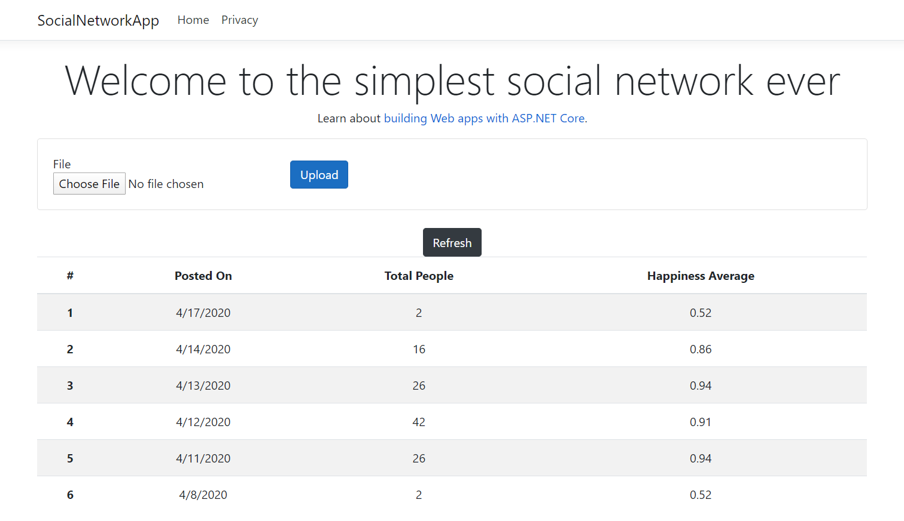
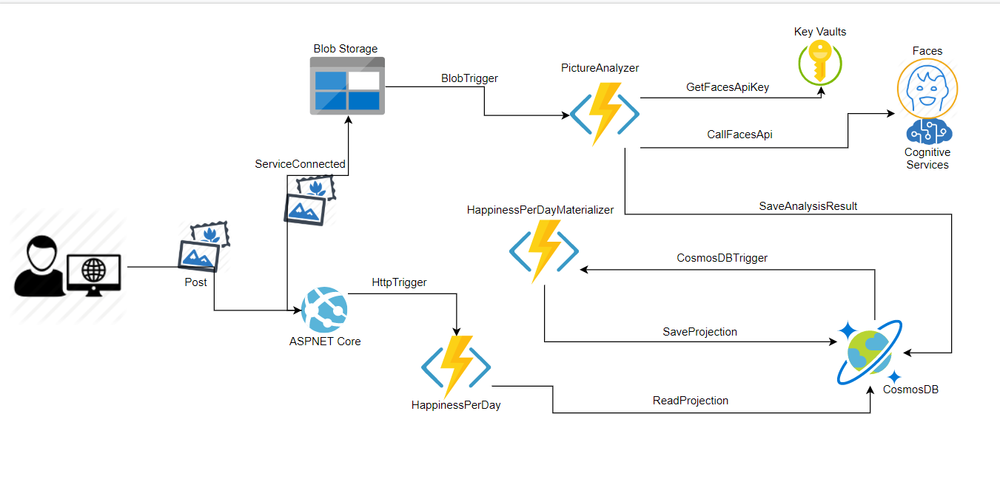
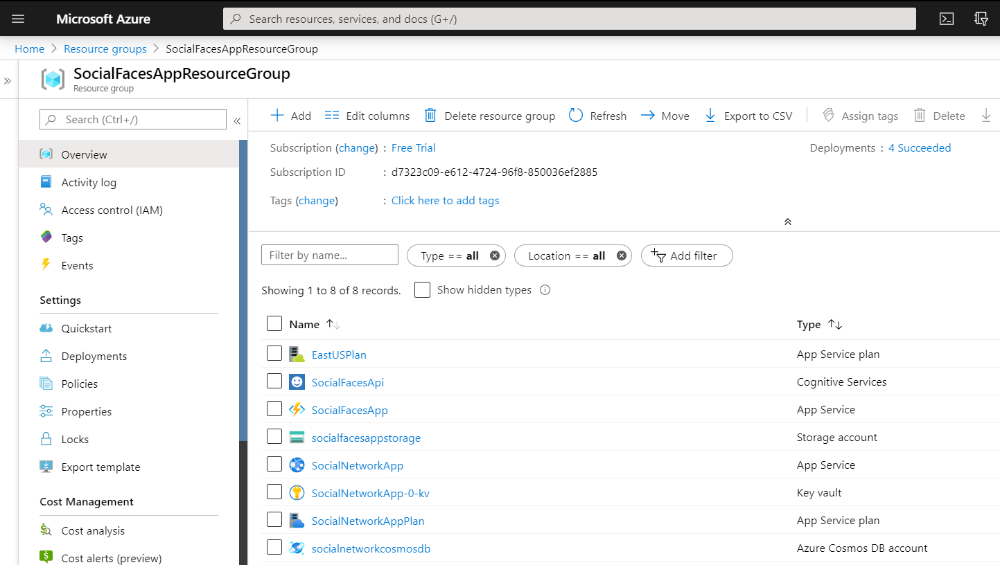

# Faces

## The simplest social network ever

The aim of this project is to put in practice some of the recent adquired Azure knowledge.
The UI is very simple and its only porpuse is to allow the user post images as input and see the computed results as output.

## Description

Now days a very common practice on internet is posting pictures on social networks. Most of them are about people :).
We want to messaure how happy people are in posted pictures.
We provide a view with the total people in pictures and theirs happiness average on every day.

## Life Cycle

1. User posts a picture containing faces -the more faces, the better- into the webserver
   1. The posted date is set randomly with an offset of +- 5 days to simulate many inputs in different days.
2. The picture is stored in blob storage
3. A funtion is triggered(**BlobTrigger**) and received the posted picture,
   1. Gets face api key from key vaults
   2. Sends picture to the face service to be processed 
   3. And stores results in a cosmos db container
4. A second function is triggered(**CosmosDBTrigger**) receiving the change feed from cosmos db,
   1. Processes the changes
   2. And updates the happiness per day projection in a different container
5. A third http functon(**HttpTrigger**) is in charge to provide all data from the materilized view when user requires it
6. User can see the consolidated data on the same page. It might be possible you have to use the Refresh button to update data :)

### UI

### Cloud diagram

### Azure resources

